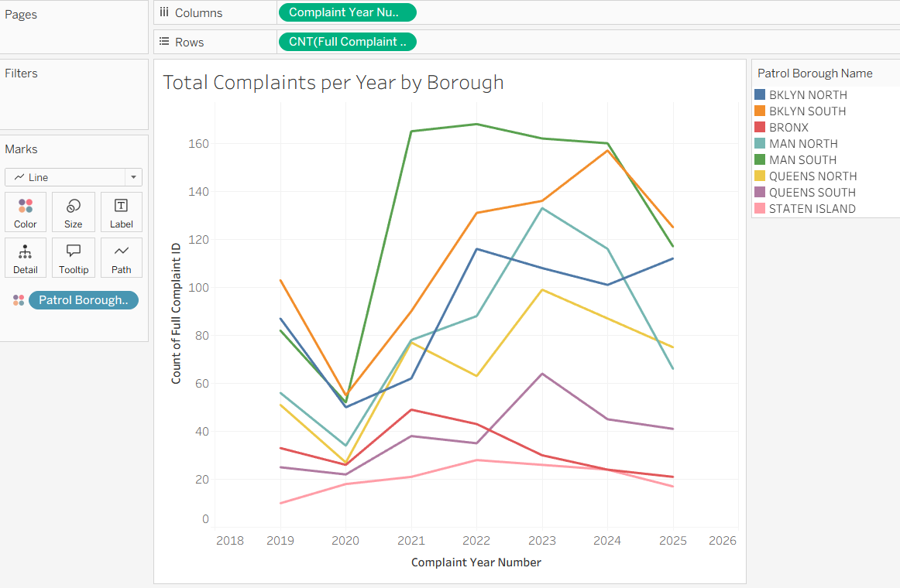
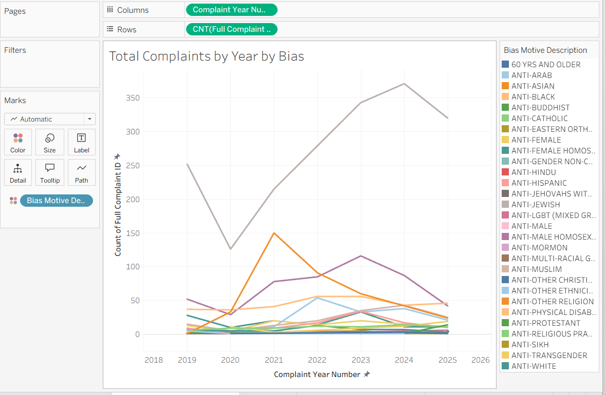
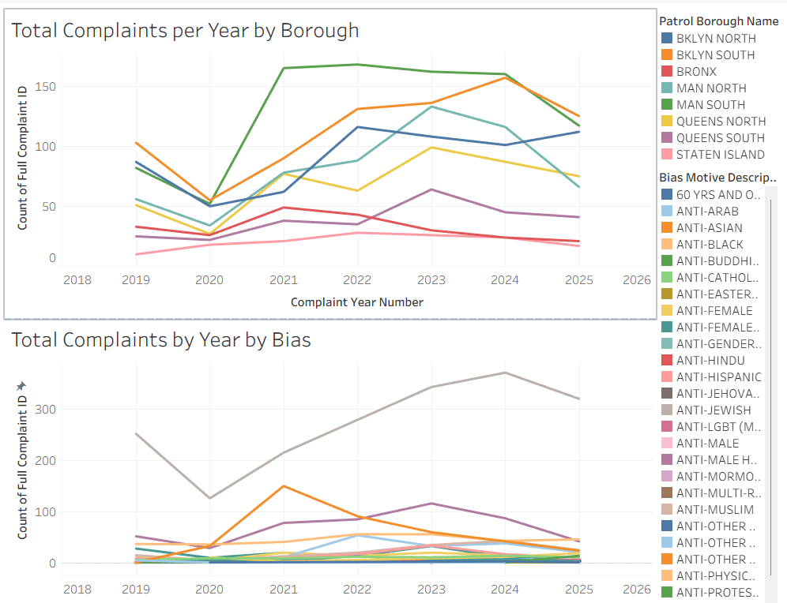
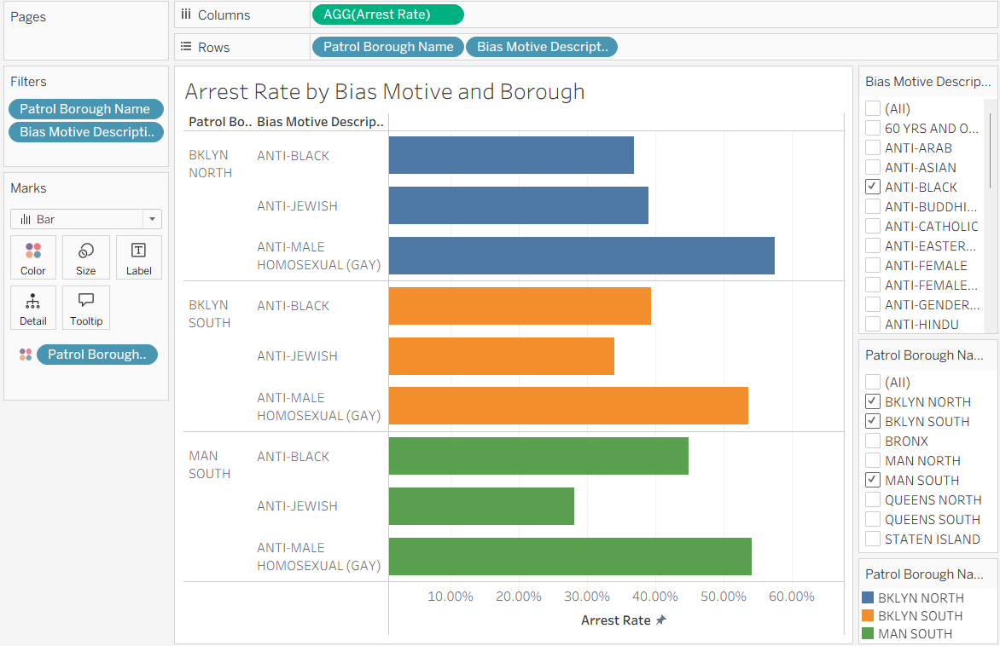
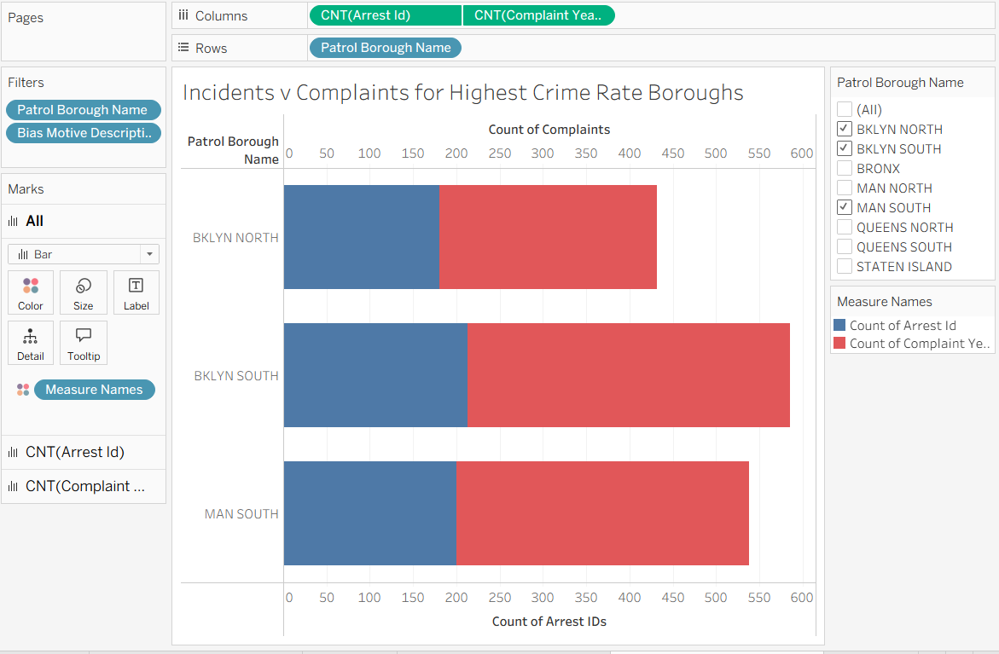
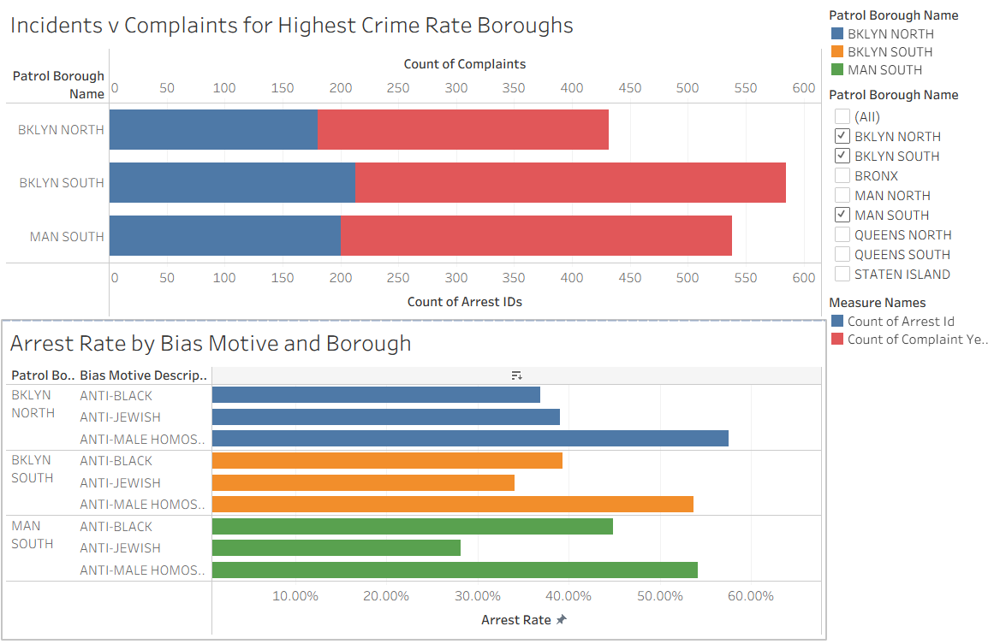

# MIST 4610 Group Project 2 - Group 7

## Group Members:

1. Donovan D'Silva - 	[repo](https://github.com/donmelsil/MIST-4610-Group-Project-2---Group-7)
2. Noah Hammond	-[repo](https://github.com/NoahHammond1/Group-Project2)
3. Chase Lin - [repo](https://github.com/cinnamotz/mist4610gp2)
4. Krithin Lokasani	- [repo](https://github.com/lokasanikrithin-source/MIST4610GP2)
5. Jessica Ngo -[repo](https://github.com/jn83499/Mist4610_Group-Project2)

## Dataset and Description
The dataset, titled “NYPD Hate Crimes”, contains records of reported hate crime incidents investigated by the New York Police Department (NYPD). Each row represents a single complaint, including details about the offense, location, bias motivation, and whether an arrest was made.

Dataset was obtained from Data.gov (https://catalog.data.gov/), the U.S. government’s open data portal. It aggregates datasets from federal, state, and local agencies, and this dataset originates from the NYPD as part of New York City’s public data initiatives.

Number of rows: 4,029

Number of columns: 14

Each row corresponds to one reported hate crime complaint.

The dataset contains a mix of numerical and categorical variables, making it suitable for both statistical and categorical analysis. Several fields related to arrests contain missing values, indicating incidents where no arrest was made. The data supports analysis of temporal trends, geographic distribution, and bias motivations behind hate crimes.

Overall, this dataset provides a comprehensive view of hate crime incidents in New York City, including when and where they occurred, the type of offense, and the underlying bias motivation. Its structure makes it well-suited for exploratory data analysis and identifying patterns in hate crime activity.

### Columns and Data Types
1. Full Complaint ID (float64): Unique identifier for each complaint.
2. Complaint Year Number (int64): Year the complaint was filed.
3. Month Number (int64): Month of occurrence (1–12).
4. Record Create Date (string/object): Date the record was entered into the system.
5. Complaint Precinct Code (int64): Numeric code for the NYPD precinct.
6. Patrol Borough Name (string/object): Borough-level patrol division.
7. County (string/object): County where the incident occurred.
8. Law Code Category Description (string/object): Legal classification (e.g., felony, misdemeanor).
9. Offense Description (string/object): General type of crime.
10. PD Code Description (string/object): Specific NYPD classification of the offense.
11. Bias Motive Description (string/object): Motivation behind the hate crime.
12. Offense Category (string/object): Broader grouping of offenses.
13. Arrest Date (float64 / nullable): Date of arrest, if applicable.
14. Arrest Id (string/object): Identifier for associated arrest, if any.

## Questions

**Question 1:**

How have hate crimes changed over time in the New York City Boroughs, and what are the biases that effect these changes?

Why it’s important:
This question is important from a social and cultural perspective because it helps identify which communities are being targeted and how those patterns evolve over time. Changes in hate crime frequency can reflect broader societal trends, such as shifts in public sentiment, major political events, or periods of increased social tension.

From a cultural standpoint, understanding bias motivations (e.g., race, religion, sexual orientation) highlights which groups are most vulnerable and can guide advocacy efforts and community support initiatives.

From an economic perspective, increases in hate crimes in certain boroughs may negatively impact local economies by discouraging business activity, tourism, and residential stability.

*Connection to dataset:*

Complaint Year Number and Month Number are used to analyze trends over time
Patrol Borough Name / County are used to compare across NYC boroughs
Bias Motive Description identify the underlying motivations driving hate crimes

These fields allow for a combined temporal, geographic, and categorical analysis of hate crime patterns.

**Question 2:**

By focusing on the top 3 biases and boroughs, how effective was law enforcement in terms of their response to these crimes?

Why it’s important:
This question is critical from a legal and public policy perspective because it evaluates the effectiveness of law enforcement responses to hate crimes. Measuring effectiveness (e.g., through arrest rates) helps determine whether justice systems are successfully addressing these incidents.

From a social trust perspective, the ability (or inability) of law enforcement to respond effectively can influence public confidence, especially among communities that are frequently targeted.

From a cultural and equity standpoint, analyzing response effectiveness across different bias types may reveal disparities in how cases are handled, which could point to systemic challenges or resource gaps.

*Connection to dataset:*

Bias Motive Description are used to identify the top three most common bias types
Patrol Borough Name / County are used to identify the top boroughs with the highest incident counts
Arrest Date and Arrest Id are used to determine whether an arrest was made (proxy for law enforcement response effectiveness)
Complaint Year Number allows us to evaluate the effectiveness over time

These variables enable calculation of arrest rates by bias type and borough, providing a measurable way to assess law enforcement performance.

## Data Manipulations and Calculations

We only had a single calculated field in our analysis, Arrest Rate. Arrest Rate is calculated by taking the value from count(Arrest Id) and dividing it by count(Full Complaint ID). The reason we wanted to manipulate the data to receive this value was to find a way to quantify the success rate of law enforcement for our second question. This value gives us the rate at which complaint cases are actually pursued compared to a case that is dropped. While a case may be dropped for a multitude of reasons, given the size of out data, this will still be a valuable insight into the success of law enforcement in New York City borroughs.

## Analysis and Results

**Question 1 — How have hate crimes changed over time, and what biases drive them?**

Temporal pattern across boroughs (Images 1 & 3): Every borough shows the same structural shape — a sharp contraction in 2020 consistent with COVID-19 lockdowns reducing public interactions, followed by a sustained and significant escalation from 2021 through 2024. Manhattan South is the standout borough, nearly doubling its complaint count from ~85 (2019) to ~160 (2024). Brooklyn South closely trails, peaking around 155–160. Staten Island remains persistently low (under 25 per year), suggesting geographic clustering of hate-crime activity in the denser, more commercially active parts of the city.

Bias motives (Images 2 & 3): Anti-Jewish bias is by far the dominant motive — it dwarfs every other category, rising from ~255 complaints in 2019 to a peak of approximately 370 in 2024 before slightly declining. Two secondary spikes stand out with clear social causation:
- Anti-Asian surged sharply in 2021, closely tracking the wave of COVID-19 xenophobia documented nationally.
- Anti-Black complaints climbed steadily from 2021–2023, likely reflecting a combination of increased awareness and reporting following the 2020 social justice movement.

All other bias categories (Anti-Muslim, Anti-Hispanic, Anti-LGBT mixed group, etc.) remain comparatively low but persistent throughout the period.

**Question 2 — How effective was law enforcement in the top 3 boroughs?**

Overall arrest gap (Images 4, 5 & 6): Across Brooklyn North, Brooklyn South, and Manhattan South, roughly 60–70% of complaints do not result in an arrest — a consistent and concerning enforcement gap. Brooklyn South has the highest complaint volume (~575 total) but a similar arrest proportion to the others.
By bias motive, the picture diverges markedly:

- Anti-Male Homosexual (Gay) crimes have the highest arrest rates across all three boroughs (54–57%). This likely reflects the nature of these incidents — they more often involve direct physical confrontation in identifiable settings, making perpetrators easier to apprehend.
- Anti-Black crimes fall in the middle range (38–46%), varying by borough.
- Anti-Jewish crimes carry the lowest arrest rates (29–40% depending on borough), despite being the overwhelmingly most frequent category. This paradox almost certainly reflects the offense type composition — Anti-Jewish hate crimes disproportionately involve vandalism, graffiti, and verbal harassment, which are inherently harder to prosecute than physical assaults where a perpetrator is present and witnesses exist.

Policy implication: The NYPD's Hate Crime Task Force faces its greatest challenge precisely where the volume is highest. Improving arrest rates for Anti-Jewish crimes likely requires enhanced surveillance of known vandalism hotspots, better forensic follow-through on graffiti cases, and community-based tip infrastructure — rather than simply increased patrol presence.

## Tableau Packaged Workbook

### Additional Tableau Screenshots

